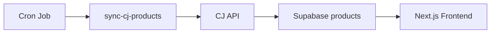

# Guide d'intégration CJ Dropshipping

Guide complet pour l'intégration de CJ Dropshipping avec votre stack Next.js/Supabase.

## 🚀 Démarrage rapide

### 1. Installation et configuration

```bash
# 1. Installer Supabase CLI (si pas déjà installé)
npm install -g supabase

# 2. Initialiser le projet Supabase
cd /home/user/fetra
supabase init

# 3. Lier votre projet Supabase
supabase login
supabase link --project-ref votre-project-ref

# 4. Appliquer les migrations
supabase db push

# 5. Configurer les secrets
supabase secrets set CJ_CLIENT_ID=votre_client_id
supabase secrets set CJ_CLIENT_SECRET=votre_client_secret

# 6. Déployer les Edge Functions
supabase functions deploy sync-cj-products
supabase functions deploy create-cj-order
supabase functions deploy get-cj-tracking
```

### 2. Tester l'intégration

```javascript
// Test 1: Synchroniser des produits K-Beauty
const syncResponse = await fetch(
  'https://votre-projet.supabase.co/functions/v1/sync-cj-products',
  {
    method: 'POST',
    headers: {
      'Authorization': `Bearer ${SUPABASE_ANON_KEY}`,
      'Content-Type': 'application/json',
    },
    body: JSON.stringify({
      keyWord: 'Gua Sha',
      pageSize: 10,
      maxPages: 2,
    }),
  }
);

const syncData = await syncResponse.json();
console.log('Produits synchronisés:', syncData.stats);

// Test 2: Vérifier les produits dans Supabase
const { data: products } = await supabase
  .from('products')
  .select('*')
  .limit(5);

console.log('Produits en base:', products);
```

## 📋 Workflow complet

### Étape 1: Synchronisation des produits



**Code d'exemple :**

```typescript
// app/api/admin/sync-products/route.ts
import { NextResponse } from 'next/server';

export async function POST() {
  const response = await fetch(
    `${process.env.SUPABASE_URL}/functions/v1/sync-cj-products`,
    {
      method: 'POST',
      headers: {
        'Authorization': `Bearer ${process.env.SUPABASE_SERVICE_ROLE_KEY}`,
        'Content-Type': 'application/json',
      },
      body: JSON.stringify({
        keyWord: 'K-Beauty',
        maxPages: 10,
      }),
    }
  );

  const data = await response.json();
  return NextResponse.json(data);
}
```

### Étape 2: Afficher les produits sur le site

```typescript
// app/products/page.tsx
import { createClient } from '@supabase/supabase-js';

const supabase = createClient(
  process.env.NEXT_PUBLIC_SUPABASE_URL!,
  process.env.NEXT_PUBLIC_SUPABASE_ANON_KEY!
);

export default async function ProductsPage() {
  const { data: products } = await supabase
    .from('products')
    .select('*')
    .order('created_at', { ascending: false })
    .limit(20);

  return (
    <div>
      <h1>Produits K-Beauty</h1>
      <div className="grid grid-cols-4 gap-4">
        {products?.map((product) => (
          <div key={product.id} className="border p-4">
            
            <h2>{product.name}</h2>
            <p>{product.price} EUR</p>
            <p>Stock: {product.stock}</p>
          </div>
        ))}
      </div>
    </div>
  );
}
```

### Étape 3: Passer une commande

```typescript
// app/api/orders/create/route.ts
import { NextRequest, NextResponse } from 'next/server';
import { createClient } from '@supabase/supabase-js';

export async function POST(request: NextRequest) {
  const body = await request.json();
  const {
    userId,
    items, // [{ productId, cjProductId, cjVariantId, quantity, price, name }]
    shippingAddress,
    totalAmount,
  } = body;

  const supabase = createClient(
    process.env.NEXT_PUBLIC_SUPABASE_URL!,
    process.env.SUPABASE_SERVICE_ROLE_KEY!
  );

  // 1. Créer la commande dans Supabase
  const { data: order, error } = await supabase
    .from('orders')
    .insert({
      user_id: userId,
      order_number: `ORDER-${Date.now()}`,
      status: 'pending',
      total_amount: totalAmount,
      shipping_address: shippingAddress,
      items: items,
    })
    .select()
    .single();

  if (error) {
    return NextResponse.json({ error: error.message }, { status: 500 });
  }

  // 2. Envoyer la commande à CJ Dropshipping
  const cjResponse = await fetch(
    `${process.env.SUPABASE_URL}/functions/v1/create-cj-order`,
    {
      method: 'POST',
      headers: {
        'Authorization': `Bearer ${process.env.SUPABASE_SERVICE_ROLE_KEY}`,
        'Content-Type': 'application/json',
      },
      body: JSON.stringify({ orderId: order.id }),
    }
  );

  const cjData = await cjResponse.json();

  return NextResponse.json({
    success: true,
    order: order,
    cjOrder: cjData,
  });
}
```

### Étape 4: Suivre la commande

```typescript
// app/orders/[orderId]/page.tsx
import { createClient } from '@supabase/supabase-js';

export default async function OrderTrackingPage({
  params,
}: {
  params: { orderId: string };
}) {
  const supabase = createClient(
    process.env.NEXT_PUBLIC_SUPABASE_URL!,
    process.env.NEXT_PUBLIC_SUPABASE_ANON_KEY!
  );

  // Récupérer les infos de tracking
  const trackingResponse = await fetch(
    `${process.env.NEXT_PUBLIC_SUPABASE_URL}/functions/v1/get-cj-tracking`,
    {
      method: 'POST',
      headers: {
        'Authorization': `Bearer ${process.env.NEXT_PUBLIC_SUPABASE_ANON_KEY}`,
        'Content-Type': 'application/json',
      },
      body: JSON.stringify({ orderId: params.orderId }),
    }
  );

  const { tracking } = await trackingResponse.json();

  return (
    <div>
      <h1>Suivi de commande</h1>
      <p>Statut: {tracking.orderStatus}</p>
      <p>Numéro de suivi: {tracking.trackingNumber}</p>
      <p>Transporteur: {tracking.logisticName}</p>

      <h2>Historique</h2>
      <ul>
        {tracking.trackingEvents?.map((event: any, i: number) => (
          <li key={i}>
            {event.time}: {event.description} - {event.location}
          </li>
        ))}
      </ul>
    </div>
  );
}
```

## 🔄 Webhooks CJ Dropshipping (Optionnel)

Pour recevoir des notifications automatiques de CJ (changement de statut, tracking, etc.), configurer un webhook :

### 1. Créer l'Edge Function webhook

```typescript
// supabase/functions/cj-webhook/index.ts
import { serve } from 'https://deno.land/std@0.168.0/http/server.ts';
import { createClient } from 'https://esm.sh/@supabase/supabase-js@2';

serve(async (req) => {
  const supabase = createClient(
    Deno.env.get('SUPABASE_URL')!,
    Deno.env.get('SUPABASE_SERVICE_ROLE_KEY')!
  );

  const webhookData = await req.json();
  console.log('Webhook received:', webhookData);

  // Traiter selon le type d'événement
  switch (webhookData.type) {
    case 'ORDER_STATUS_CHANGED':
      await supabase
        .from('orders')
        .update({ status: webhookData.newStatus })
        .eq('cj_order_id', webhookData.orderId);
      break;

    case 'TRACKING_UPDATED':
      await supabase
        .from('orders')
        .update({
          tracking_number: webhookData.trackingNumber,
          logistic_name: webhookData.logisticName,
        })
        .eq('cj_order_id', webhookData.orderId);
      break;
  }

  return new Response(JSON.stringify({ received: true }), {
    headers: { 'Content-Type': 'application/json' },
  });
});
```

### 2. Configurer le webhook dans CJ

1. Aller dans CJ Dashboard → API Settings → Webhooks
2. Ajouter l'URL : `https://votre-projet.supabase.co/functions/v1/cj-webhook`
3. Sélectionner les événements à recevoir

## 🎯 Cas d'usage avancés

### Synchronisation incrémentale

Pour ne synchroniser que les nouveaux produits ou ceux modifiés :

```typescript
// Stocker la dernière date de sync
const lastSync = await supabase
  .from('cj_sync_logs')
  .select('completed_at')
  .eq('status', 'success')
  .eq('sync_type', 'products')
  .order('completed_at', { ascending: false })
  .limit(1)
  .single();

// Filtrer par date de mise à jour (si supporté par l'API CJ)
const products = await getProductList({
  keyWord: 'K-Beauty',
  updatedAfter: lastSync?.completed_at,
});
```

### Gestion des variantes multiples

Si un produit a plusieurs variantes (couleur, taille), créer une entrée par variante :

```typescript
for (const variant of cjProduct.variants) {
  await supabase.from('products').upsert({
    cj_product_id: cjProduct.pid,
    cj_variant_id: variant.vid,
    name: `${cjProduct.productNameEn} - ${variant.variantNameEn}`,
    price: variant.variantSellPrice,
    stock: variant.variantInventory,
    sku: variant.variantSku,
    // ...
  }, {
    onConflict: 'cj_variant_id',
  });
}
```

### Mise à jour automatique du stock

Créer un cron job pour mettre à jour le stock :

```typescript
// app/api/cron/update-stock/route.ts
export async function GET(request: NextRequest) {
  const { data: products } = await supabase
    .from('products')
    .select('id, cj_product_id');

  for (const product of products || []) {
    const inventory = await getProductInventory(product.cj_product_id);

    await supabase
      .from('products')
      .update({ stock: inventory.totalInventoryNum })
      .eq('id', product.id);
  }

  return Response.json({ success: true });
}
```

## 📊 Monitoring et analytics

### Dashboard de synchronisation

Afficher les logs de sync dans un dashboard admin :

```typescript
// app/admin/sync-logs/page.tsx
const { data: logs } = await supabase
  .from('cj_sync_logs')
  .select('*')
  .order('started_at', { ascending: false })
  .limit(50);

return (
  <table>
    <thead>
      <tr>
        <th>Date</th>
        <th>Type</th>
        <th>Status</th>
        <th>Traités</th>
        <th>Créés</th>
        <th>Mis à jour</th>
        <th>Échoués</th>
        <th>Durée</th>
      </tr>
    </thead>
    <tbody>
      {logs?.map((log) => (
        <tr key={log.id}>
          <td>{new Date(log.started_at).toLocaleString()}</td>
          <td>{log.sync_type}</td>
          <td>{log.status}</td>
          <td>{log.items_processed}</td>
          <td>{log.items_created}</td>
          <td>{log.items_updated}</td>
          <td>{log.items_failed}</td>
          <td>{log.duration_ms}ms</td>
        </tr>
      ))}
    </tbody>
  </table>
);
```

## 🔒 Sécurité

### Row Level Security (RLS)

Activer RLS sur les tables pour protéger les données :

```sql
-- Activer RLS
ALTER TABLE products ENABLE ROW LEVEL SECURITY;
ALTER TABLE orders ENABLE ROW LEVEL SECURITY;

-- Policy pour les produits (publics)
CREATE POLICY "Products are viewable by everyone"
  ON products FOR SELECT
  USING (true);

-- Policy pour les commandes (uniquement par l'utilisateur)
CREATE POLICY "Users can view their own orders"
  ON orders FOR SELECT
  USING (auth.uid() = user_id);

CREATE POLICY "Users can create their own orders"
  ON orders FOR INSERT
  WITH CHECK (auth.uid() = user_id);
```

### Validation des données

Valider les données côté Edge Function avant de les envoyer à CJ :

```typescript
// Valider l'adresse
if (!shippingAddress.countryCode || shippingAddress.countryCode.length !== 2) {
  throw new Error('Invalid country code (must be ISO 2-letter code)');
}

// Valider les produits
for (const item of items) {
  if (!item.cj_variant_id && !item.cj_product_id) {
    throw new Error('Each item must have a CJ product or variant ID');
  }
  if (item.quantity <= 0) {
    throw new Error('Quantity must be greater than 0');
  }
}
```

## 📚 Ressources supplémentaires

- [Documentation officielle CJ Dropshipping](https://developers.cjdropshipping.com/)
- [Documentation Supabase Edge Functions](https://supabase.com/docs/guides/functions)
- [Guide Deno pour débutants](https://deno.land/manual/getting_started)
- [Supabase CLI Reference](https://supabase.com/docs/reference/cli)

## 💡 Conseils et bonnes pratiques

1. **Rate limiting** : Respectez les limites de l'API CJ (généralement 1 token request / 5 min)
2. **Retry logic** : Utilisez la logique de retry intégrée dans le client API
3. **Logs** : Consultez régulièrement `cj_sync_logs` pour détecter les problèmes
4. **Cache** : Utilisez le cache intégré pour les tokens (économise des appels API)
5. **Erreurs** : Gérez gracieusement les erreurs et alertez les administrateurs
6. **Tests** : Testez d'abord en environnement staging avant la production

## 🐛 Bugs connus et limitations

1. **Token expiry**: Les tokens CJ expirent (durée variable). Le système gère automatiquement le refresh.
2. **Pagination**: L'API CJ limite les résultats à 100 produits/page max.
3. **Images**: Certaines images peuvent être bloquées par CORS. Utiliser un proxy si nécessaire.
4. **Délais**: Les changements de statut dans CJ peuvent prendre jusqu'à 30 minutes pour apparaître.

---

**Besoin d'aide ?** Consultez les logs Supabase ou la documentation CJ Dropshipping.
